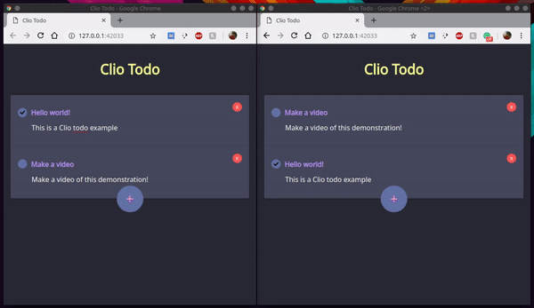

# clio-todo

**Warning: This example is obsolete. It is being reworked with the current version of clio**

This is a simple Clio demonstration showing how to use Node.js libraries with Clio (Rethinkdb in this example), how to use browser js libraries (jQuery in this example), how to use Clio host utility and microservices, and how to use Clio in the browser.

This is a simple reactive todo app made with Clio. To run this example you'll need Rethinkdb, Node.js and Clio.



## how to run

First, you need to host the host file
```
clio host host.clio
```
  
Now, you will need a simple http server (live-server or python -m http.server)
```
live-server
```
